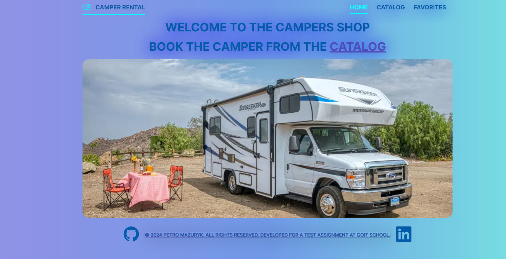

                         Сервіс оренди кемперів !

This project is a test task for developing a web application for a company that
offers camper van rental services in Ukraine.

The application consists of three main parts pages: The main page: Contains a
general description of the services provided by the company. Catalog page:
Contains a catalog of campers with various configurations, locations, equipment,
and types. Favorites page: Shows a list of ads that the user has favorited.

Functionality: Main page: Contains a general description of the company's
services. Page directory: Displays a list of camper ads. First, it shows four
ads, more can be loaded using the "Load more" button. The y button in the form
of a heart adds the ad to favorites and changes its color. This state is saved
when the page is reloaded. Pressing again deletes ad from favorites and returns
the color of the button. The "Show more" button opens a modal window with
detailed information about the camper. The window can be closed by clicking the
close button, clicking on the background, or pressing the Esc key. Modal window
contains camper details and user reviews displayed depending on active tab.
There is also a booking form with fields for name, email, date reservation and
comment.

Implemented technical requirements: Fixed pixel layout, semantic and valid HTML.
Absence of errors inbrowser console. Using Redux to manage state. Using Axios
for HTTP requests. Implementation on native JavaScript using bundler Vite and
React. Interactive elements work according to the technical task. The code is
formatted and contains no comments. Configuring the MockAPI backend. Used
MockAPI to create custom backend for development. Created adverts resource with
fields: id, name, price, rating, location, adults, children, engine,
transmission, form, length, width, height, tank, consumption, description,
details, gallery, reviews. The database contains 15 ads with different values
Implemented pagination to display 4 ads per page.

Routing Used React Router for routing: The following routes are defined: — Main
page /catalog — Catalog page/favorites — Favorites page Redirection to the main
page is configuredfor non-existent routes.

Development and Deployment The application is developed using React with the
Vite bundler. The project is deployed on GitHub Pages.

Launching the project: Clone the repository. Install dependencies: npm install
Start the development server: npm run dev or npm start.
