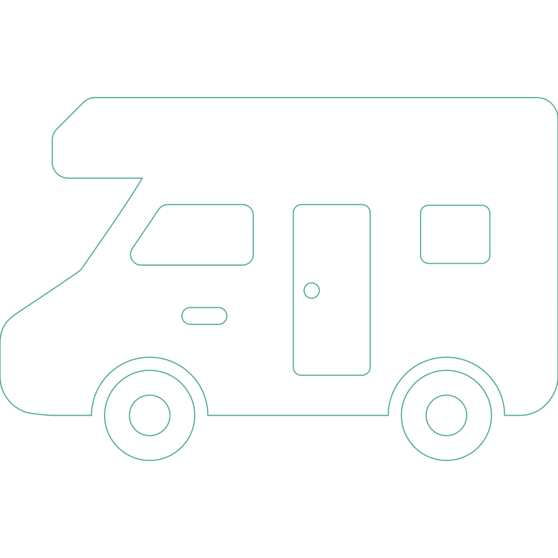

# Camper Rental App 

**Camper Rental Services**

[Github](https://github.com/PetroMazuryk/camper-rental)

[Live page](https://camper-rental-nine.vercel.app/)

## Overview

This project is a test assignment for creating a web application for a company
that offers camper rental services in Ukraine.

## The app consists of three main pages:

### Home Page:

General description of the services provided by the company.

### Catalog Page:

A catalog of campers with different configurations, locations, equipment, and
types.

### Favorites Page:

A list of listings that the user has added to their favorites.

## Functionality

- Home Page: General description of the company's services.
- Catalog Page: Displays a list of camper listings. Initially, 4 listings are
  shown, with more loaded upon clicking the "Load more" button. Clicking the
  heart-shaped button on a listing adds it to the favorites list and changes the
  button color. The state of the heart button is preserved upon page reload.
  Clicking the heart button again removes the listing from the favorites list
  and returns the button to its original color. Clicking the "Show more" button
  opens a modal window with detailed information about the camper. The modal
  window can be closed by clicking the close button, clicking on the backdrop,
  or pressing the Esc key. The modal window contains details about the camper
  and user reviews, which are displayed based on the active tab. The modal
  window also includes a booking form with fields for name, email, booking date,
  and comment. The name, email, and booking date fields are mandatory and
  undergo validation. Fields filled out by the user retain their state in local
  storage and are cleared upon data submission.
- Favorites Page: Displays listings that the user has added to their favorites.

## Implemented Technical Requirements

- Fixed pixel layout, semantic and valid HTML.
- No errors in the browser console.
- Using Redux for state management.
- Using Axios for HTTP requests.
- Implemented in native JavaScript using Vite bundler and React.
- Interactive elements work according to the technical specifications.
- Code is formatted and free of comments.
- The project is deployed on GitHub Pages.

## MockAPI Backend Setup

MockAPI is used to create a personal backend for development.

A resource named `adverts` is created with the following fields:

\_id name price rating location adults children engine transmission form length
width height tank consumption description details gallery reviews

The database contains 15 listings with different values.

Pagination is implemented to display 4 listings per page.

## Routing

React Router is used for routing. The following routes are defined:

- / - Home Page
- /catalog - Catalog Page
- /favorites - Favorites Page

Redirects to the home page for non-existent routes.

## Development and Deployment

The app is developed using React with the Vite bundler. The project is deployed
on GitHub Pages.

### Running the Project

1. Clone the repository.
2. Install dependencies: npm install
3. Start the development server: npm run dev or npm start
4. Open your browser and go to http://localhost:3000
